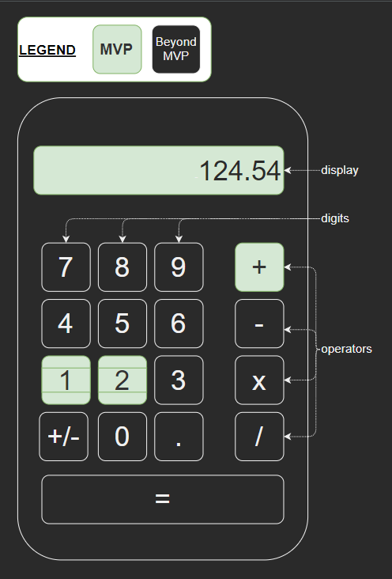
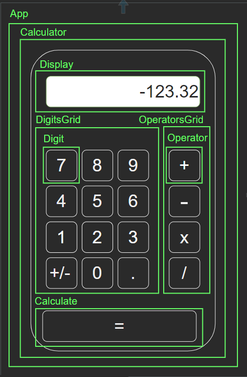

# React Calculator using TDD with Jest

## Description:

This project is a pair-programming collaboration between nicfheorais
(https://github.com/nicfheorais) and GeckoJen (https://github.com/GeckoJen).

The aim is to practice test driven design through building a simple calculator
in React.

 

## Documentation:

Wireframe design and Component breakdown are here:

[calculator-design.drawio](./calculator-design.drawio)

Our plan for how to break down the problem is here:

[calculator-plan-algorithm.md](./calculator-plan-algorithm.md)
